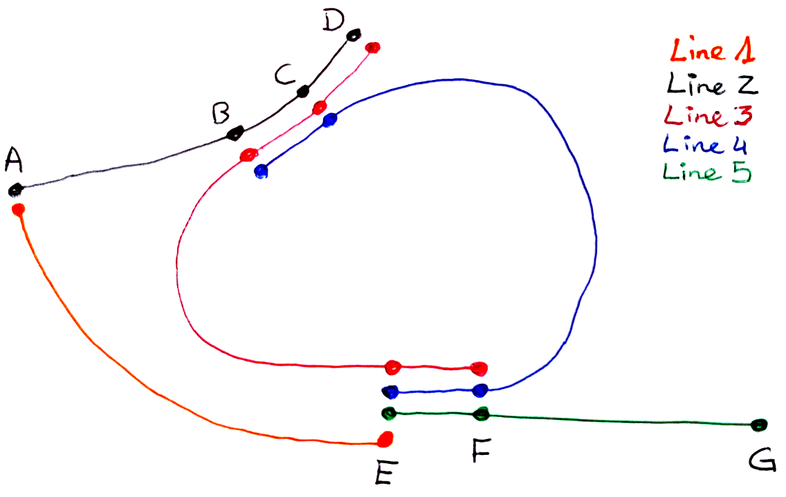

# Documentation of the routing algorithm

## The implemented algorithm

### Abstract

a quick view

### Example 1

Line 1 (every 20 minutes):

| A  | E  |
|----|----|
|7:50|8:50|
|8:10|9:10|
|8:30|9:30|

Line 2 (every 10 minutes):

| A  | B  | C  | D  |
|----|----|----|----|
|8:00|8:30|8:33|8:36|
|8:10|8:40|8:43|8:46|
|8:20|8:50|8:53|8:56|

Line 3 (every 5 minutes):

| D  | C  | B  | E  | F  |
|----|----|----|----|----|
|8:35|8:38|8:41|9:00|9:02|
|8:40|8:43|8:46|9:05|9:07|
|8:45|8:48|8:51|9:10|9:12|

Line 4 (every 5 minutes):

| B  | C  | F  | E  |
|----|----|----|----|
|8:35|8:40|9:00|9:02|
|8:40|8:45|9:05|9:07|
|8:45|8:50|9:10|9:12|

Line 5 (every 20 minutes):

| E  | F  |  G  |
|----|----|-----|
|9:05|9:07|10:00|
|9:25|9:27|10:20|
|9:45|9:47|10:40|

Connections: only intra stop point, 2 minutes except for F 3 minutes.

### RAPTOR and the specificities

The routing algorithm is build around RAPTOR, a routing algorithm developped at Microsoft and published in 2012. The paper can be found [here](https://www.microsoft.com/en-us/research/wp-content/uploads/2012/01/raptor_alenex.pdf).

Basically, you give to RAPTOR the set of journey patterns it can use, the set of stop points it can use (for transfers), the datetime you can reach the stop points and the direction. It gives you, for each stop points and each number of transfers, the earliest arrival datetime.

Our implementation is very close to the original RAPTOR algorithm. There is 2 added functionnalities:
 - stay in: they are oportunistic, i.e. it is not guananteed to be optimally using the stay in. The journey patterns doesn't take the stay in into account.
 - ITL: as we are only one zone per stop time, the implementation is quite straightforward: at the furst pickup, we set the current zone to the zone of the stop point. If the zone change, no more drop off is forbidden because of the zone because we can choose afterward the good pick up.
 
 The journey pattern are generated automatically. They must have the same succession of stop times (except datetimes) and must not overtake.

### The first pass on example 1

In this section, you can find some examples of the result of raptor. Our implementation doesn't remember the vehicle journeys used, they are chosen by the raptor solution reader, explained later.

The input of the algorithm is a set of journey patterns and stop points that can be used, and a starting datetime plus durations to access the reachable stop points. These 2 last inputs are used to compute the first TR0 line.

The PTx lines correspond to the earliest arrival to a stop point using x vehicles (including stay in). The TRx correspond to the earliest arrival to a stop point after x vehicles plus the connections.

Starting from A at 7:45:

|level| A  | B  | C  | D  | E  | F  |  G      |
|-----|----|----|----|----|----|----|---------|
|TR0  |7:45|    |    |    |    |    |         |
|PT1  |    |8:30|8:33|8:36|8:50|    |         |
|TR1  |    |8:32|8:35|8:38|8:52|    |         |
|PT2  |    |    |    |    |    |9:00|**10:00**|
|TR2  |    |    |    |    |    |9:03|10:02    |
|PT3  |    |    |    |    |    |    |         |

Starting from A at 7:55:

|level| A  | B  | C  | D  | E  | F  |  G      |
|-----|----|----|----|----|----|----|---------|
|TR0  |7:55|    |    |    |    |    |         |
|PT1  |    |8:30|8:33|8:36|9:10|    |         |
|TR1  |    |8:32|8:35|8:38|9:12|    |         |
|PT2  |    |    |    |    |9:00|9:00|**10:20**|
|TR2  |    |    |    |    |9:02|9:03|10:22    |
|PT3  |    |    |    |    |    |    |**10:00**|
|TR3  |    |    |    |    |    |    |10:02    |
|PT4  |    |    |    |    |    |    |         |

The different PTx on the destination stop points gives the earliest arrival to our destinations for each number of connection. In this case, if we target G, starting at 7:45 from A gives G at 10:00using 0 connection, but starting at 7:55 gives 12:00 using 0 connection and 10:00 using 1 connection.

### Second pass

As our main objective is earliest arrival time, and then, at equal earliest arrival time, latest departure time, We need another optimization as RAPTOR doesn't minimize this. For that, we do a second pass on the journey: for each candidate arrivals, we rerun RAPTOR in the other sens, minimizing departure times.

The number of second pass can be quite high. For this, we compute a bound of the journeys ending to our current second pass initialisation, and check if this bound is dominated by the previously found journeys (found by the previous second passes). Thanks to this optimization, we can avoid a lot of useless second pass. To be safe, we globally bound the number of second passes realized (see the `max_extra_second_pass` parameter of the algorithm).

To minimize the work done by a second pass, we reuse the datetime calculated at the first pass to compute bounds on each stop point. Thanks to these bounds, the second pass avoid to compute pathes that will never be accessible by the stop points of origin, greatly reducing the search space.

### The second pass on example 1

From the first pass from A at 7:45, there is only one candidate second pass: ending at G at 10:00:

|level| A      | B  | C  | D  | E  | F  |  G  |
|-----|--------|----|----|----|----|----|-----|
|TR0  |        |    |    |    |    |    |10:00|
|PT1  |        |    |    |    |9:05|9:07|     |
|TR1  |        |    |    |    |9:03|9:04|     |
|PT2  |**7:50**|8:41|8:40|8:35|    |    |     |
|TR2  |7:48    |8:39|8:38|8:33|    |    |     |
|PT3  |**8:00**|    |    |    |    |    |     |
|TR3  |7:58    |    |    |    |    |    |     |
|PT4  |        |    |    |    |    |    |     |

The second pass find 2 stating candidates: from A at 7:50 with 1 connection, and from A at 8:00 with 2 connections.

### Solution reader

* goal
* the objectives
* the search space
* the branching scheme

### Advantages and drawbacks

advantages:
* diversity
* performance
* flexibility

drawbacks:
* not exact walking objective
* difficulty to add objectives
* RAPTOR variants quite complex and not really combinable

## Some ideas for improvement

* RAPTOR, CSA and others
* objectives
