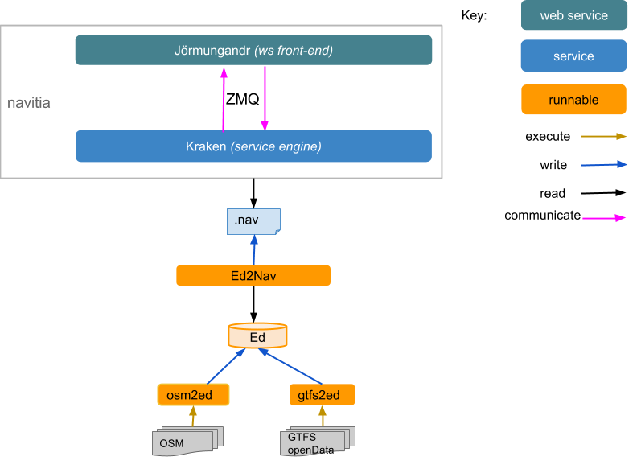

# Various data import components

As a reminder here is a simplified version of the architecture:



Nearly all data used by a kraken (the c++ core) are extracted from one database called `ed`

For each data format, one executable can be found in this module to import those data to the `ed` database and there is one component, `ed2nav` that aggregate all data found in `ed` and build the kraken input file.

The kraken input file is a binary blob file created using boost::serialize.

## common stuff
All executables offer a ```--help``` option to list the different options

Every executable needs a ```--connection-string``` option to be able to be linked to the database

This connection string must contains:
 * host: database host
 * user: database user
 * password: database password
 * dbname: name of the database

example: ```--connection-sting="host=localhost user=my_user password=my_pwd dbname=my_db"```

## ed2nav
Component that aggregate all data from `ed` and build the kraken input file.

To run this component, some public transport data *must* be loaded in the database (but other data are not mandatory)

## osm2ed
Component that load a osm .pbf file into `ed`

## gtfs2ed
Component that load a gtfs data set into `ed`.

The directory containing all gtfs text files is given with the `-i` option

## fusio2ed
Component that load a fusio data set into `ed`.

Fusio is a CanalTP custom file format derived from gtfs but with additional files.

The directory containing all fusio text files is given with the `-i` option

## nav2rt
Component that take a kraken input file in input and load real time data into it.

## fare2ed
Component that load fare data into `ed`.

Note: fares can also be loaded with fusio2ed if the fare files are in the fusio data directory

## poi2ed
Component that load poi into `ed`.

## geopal2ed
Component that load geopal street network data into `ed`.

## synomyme2ed
Component that load synomyme data into `ed`.

